# Hupyy-PipesHub Integration: Technical Architecture Documentation

## Table of Contents

1. [System Architecture Overview](#1-system-architecture-overview)
2. [Data Flow Architecture](#2-data-flow-architecture)
3. [Three-Stage Pipeline](#3-three-stage-pipeline)
4. [Component Interaction Patterns](#4-component-interaction-patterns)
5. [Metadata Architecture](#5-metadata-architecture)
6. [Ranking Algorithm Architecture](#6-ranking-algorithm-architecture)
7. [Feedback Loop Architecture](#7-feedback-loop-architecture)
8. [Failure Mode Decision System](#8-failure-mode-decision-system)
9. [Cold Start and Implementation Phases](#9-cold-start-and-implementation-phases)
10. [Monitoring and Health Dashboard](#10-monitoring-and-health-dashboard)

---

## 1. System Architecture Overview

The Hupyy-PipesHub integration creates a verification-guided search system where SMT (Satisfiability Modulo Theories) verification acts as a truth filter, continuously improving retrieval quality through deterministic feedback.

### 1.1 High-Level System Architecture

This diagram shows the complete system architecture with all major components and their relationships.

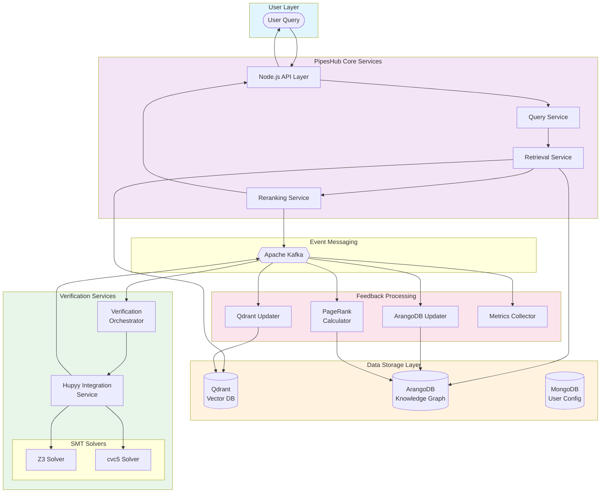
```mermaid
flowchart TB
    subgraph UserLayer["User Layer"]
        User([User Query])
    end

    subgraph PipesHubCore["PipesHub Core Services"]
        QS[Query Service]
        RS[Retrieval Service]
        RR[Reranking Service]
        API[Node.js API Layer]
    end

    subgraph DataStores["Data Storage Layer"]
        Qdrant[(Qdrant<br/>Vector DB)]
        Arango[(ArangoDB<br/>Knowledge Graph)]
        Mongo[(MongoDB<br/>User Config)]
    end

    subgraph Messaging["Event Messaging"]
        Kafka{{Apache Kafka}}
    end

    subgraph VerificationLayer["Verification Services"]
        VO[Verification<br/>Orchestrator]
        HI[Hupyy Integration<br/>Service]
        subgraph Solvers["SMT Solvers"]
            Z3[Z3 Solver]
            CVC5[cvc5 Solver]
        end
    end

    subgraph FeedbackLayer["Feedback Processing"]
        QU[Qdrant Updater]
        AU[ArangoDB Updater]
        PR[PageRank<br/>Calculator]
        MC[Metrics Collector]
    end

    User --> API
    API --> QS
    QS --> RS
    RS --> Qdrant
    RS --> Arango
    RS --> RR
    RR --> Kafka

    Kafka --> VO
    VO --> HI
    HI --> Z3
    HI --> CVC5

    HI --> Kafka
    Kafka --> QU
    Kafka --> AU
    Kafka --> PR
    Kafka --> MC

    QU --> Qdrant
    AU --> Arango
    PR --> Arango

    RR --> API
    API --> User

    style UserLayer fill:#e1f5fe
    style PipesHubCore fill:#f3e5f5
    style DataStores fill:#fff3e0
    style VerificationLayer fill:#e8f5e9
    style FeedbackLayer fill:#fce4ec
```

**Key Parameters:**
- **Qdrant**: HNSW algorithm with extensible JSON payloads
- **ArangoDB**: PageRank-based document importance scoring
- **Kafka**: Real-time event-driven messaging with <100ms latency for fast feedback

### 1.2 Microservice Integration Pattern

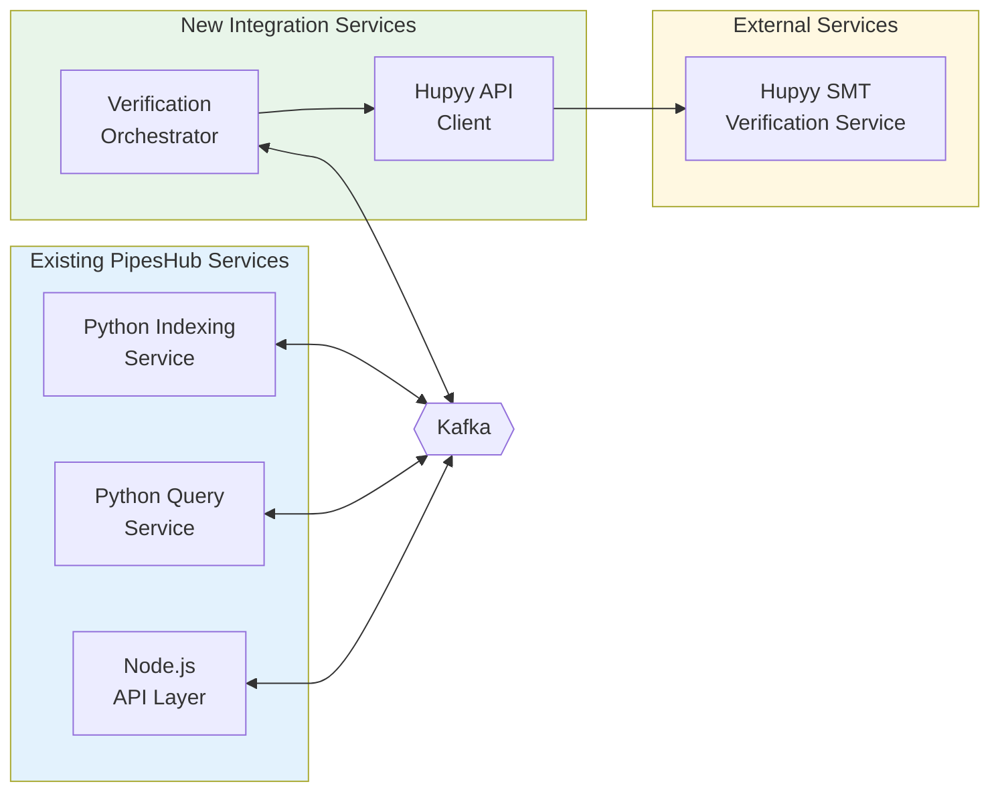
```mermaid
flowchart LR
    subgraph Existing["Existing PipesHub Services"]
        direction TB
        IndexSvc[Python Indexing<br/>Service]
        QuerySvc[Python Query<br/>Service]
        APISvc[Node.js<br/>API Layer]
    end

    subgraph New["New Integration Services"]
        direction TB
        VerifSvc[Verification<br/>Orchestrator]
        HupyyAPI[Hupyy API<br/>Client]
    end

    subgraph External["External Services"]
        Hupyy[Hupyy SMT<br/>Verification Service]
    end

    IndexSvc <--> Kafka{{Kafka}}
    QuerySvc <--> Kafka
    APISvc <--> Kafka
    VerifSvc <--> Kafka

    VerifSvc --> HupyyAPI
    HupyyAPI --> Hupyy

    style Existing fill:#e3f2fd
    style New fill:#e8f5e9
    style External fill:#fff8e1
```

---

## 2. Data Flow Architecture

### 2.1 Complete Query Pipeline

This diagram illustrates the complete data flow from user query to verified results.

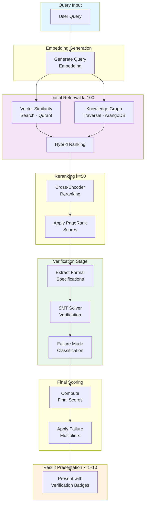
```mermaid
flowchart TD
    subgraph Input["Query Input"]
        Q[User Query]
    end

    subgraph Embedding["Embedding Generation"]
        EG[Generate Query<br/>Embedding]
    end

    subgraph Retrieval["Initial Retrieval k=100"]
        VS[Vector Similarity<br/>Search - Qdrant]
        KG[Knowledge Graph<br/>Traversal - ArangoDB]
        HR[Hybrid Ranking]
    end

    subgraph Reranking["Reranking k=50"]
        CE[Cross-Encoder<br/>Reranking]
        PR[Apply PageRank<br/>Scores]
    end

    subgraph Verification["Verification Stage"]
        EX[Extract Formal<br/>Specifications]
        SMT[SMT Solver<br/>Verification]
        FM[Failure Mode<br/>Classification]
    end

    subgraph Scoring["Final Scoring"]
        CS[Compute<br/>Final Scores]
        RK[Apply Failure<br/>Multipliers]
    end

    subgraph Output["Result Presentation k=5-10"]
        RP[Present with<br/>Verification Badges]
    end

    Q --> EG
    EG --> VS
    EG --> KG
    VS --> HR
    KG --> HR
    HR --> CE
    CE --> PR
    PR --> EX
    EX --> SMT
    SMT --> FM
    FM --> CS
    CS --> RK
    RK --> RP

    style Input fill:#e1f5fe
    style Retrieval fill:#f3e5f5
    style Verification fill:#e8f5e9
    style Output fill:#fff3e0
```

**Key Parameters:**
- Initial retrieval: k=100 candidates (maximize recall)
- After reranking: k=50 (target Recall@50 = 85%, Precision@50 = 40%)
- After verification: k=5-10 (target Precision@5 = 98%)

### 2.2 Verification Data Flow Detail

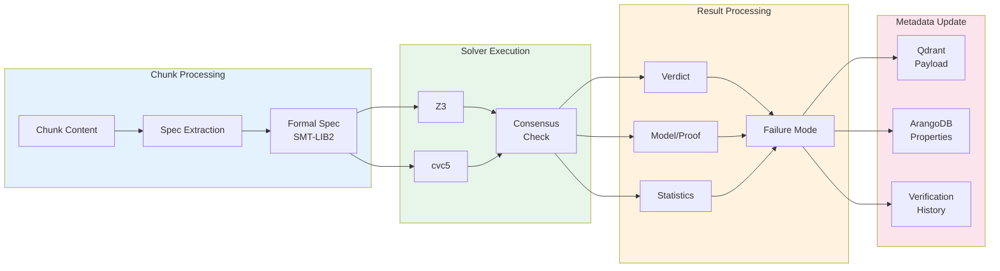
```mermaid
flowchart LR
    subgraph ChunkProcessing["Chunk Processing"]
        C[Chunk Content]
        EX[Spec Extraction]
        FS[Formal Spec<br/>SMT-LIB2]
    end

    subgraph SolverExecution["Solver Execution"]
        Z3[Z3]
        CVC5[cvc5]
        CONS[Consensus<br/>Check]
    end

    subgraph ResultProcessing["Result Processing"]
        V[Verdict]
        M[Model/Proof]
        S[Statistics]
        FM[Failure Mode]
    end

    subgraph MetadataUpdate["Metadata Update"]
        QP[Qdrant<br/>Payload]
        AP[ArangoDB<br/>Properties]
        VH[Verification<br/>History]
    end

    C --> EX
    EX --> FS
    FS --> Z3
    FS --> CVC5
    Z3 --> CONS
    CVC5 --> CONS
    CONS --> V
    CONS --> M
    CONS --> S
    V --> FM
    M --> FM
    S --> FM
    FM --> QP
    FM --> AP
    FM --> VH

    style ChunkProcessing fill:#e3f2fd
    style SolverExecution fill:#e8f5e9
    style ResultProcessing fill:#fff3e0
    style MetadataUpdate fill:#fce4ec
```

---

## 3. Three-Stage Pipeline

The core architecture operates as a three-stage pipeline with continuous learning.

### 3.1 Pipeline Stage Flow

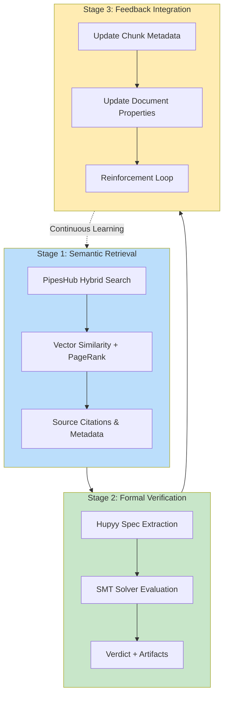
```mermaid
flowchart TD
    subgraph Stage1["Stage 1: Semantic Retrieval"]
        direction TB
        S1A[PipesHub Hybrid Search]
        S1B[Vector Similarity + PageRank]
        S1C[Source Citations & Metadata]
        S1A --> S1B --> S1C
    end

    subgraph Stage2["Stage 2: Formal Verification"]
        direction TB
        S2A[Hupyy Spec Extraction]
        S2B[SMT Solver Evaluation]
        S2C[Verdict + Artifacts]
        S2A --> S2B --> S2C
    end

    subgraph Stage3["Stage 3: Feedback Integration"]
        direction TB
        S3A[Update Chunk Metadata]
        S3B[Update Document Properties]
        S3C[Reinforcement Loop]
        S3A --> S3B --> S3C
    end

    Stage1 --> Stage2
    Stage2 --> Stage3
    Stage3 -.->|Continuous Learning| Stage1

    style Stage1 fill:#bbdefb
    style Stage2 fill:#c8e6c9
    style Stage3 fill:#ffecb3
```

### 3.2 CEGAR-Inspired Refinement Loop

The system follows a CEGAR (Counterexample-Guided Abstraction Refinement) pattern.

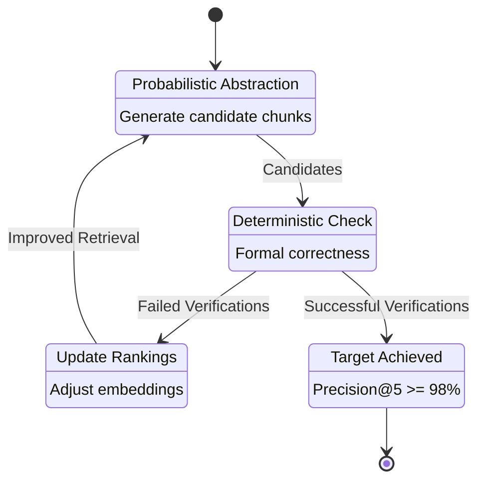
```mermaid
stateDiagram-v2
    [*] --> SemanticSearch

    SemanticSearch: Probabilistic Abstraction
    SemanticSearch: Generate candidate chunks

    SMTVerification: Deterministic Check
    SMTVerification: Formal correctness

    Refinement: Update Rankings
    Refinement: Adjust embeddings

    HighPrecision: Target Achieved
    HighPrecision: Precision@5 >= 98%

    SemanticSearch --> SMTVerification: Candidates
    SMTVerification --> Refinement: Failed Verifications
    SMTVerification --> HighPrecision: Successful Verifications
    Refinement --> SemanticSearch: Improved Retrieval
    HighPrecision --> [*]
```

---

## 4. Component Interaction Patterns

### 4.1 Verification Request Sequence

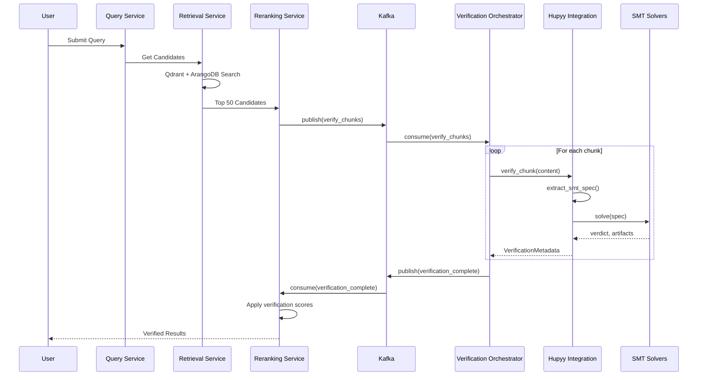
```mermaid
sequenceDiagram
    participant U as User
    participant QS as Query Service
    participant RS as Retrieval Service
    participant RR as Reranking Service
    participant K as Kafka
    participant VO as Verification Orchestrator
    participant HI as Hupyy Integration
    participant SMT as SMT Solvers

    U->>QS: Submit Query
    QS->>RS: Get Candidates
    RS->>RS: Qdrant + ArangoDB Search
    RS->>RR: Top 50 Candidates
    RR->>K: publish(verify_chunks)
    K->>VO: consume(verify_chunks)

    loop For each chunk
        VO->>HI: verify_chunk(content)
        HI->>HI: extract_smt_spec()
        HI->>SMT: solve(spec)
        SMT-->>HI: verdict, artifacts
        HI-->>VO: VerificationMetadata
    end

    VO->>K: publish(verification_complete)
    K->>RR: consume(verification_complete)
    RR->>RR: Apply verification scores
    RR-->>U: Verified Results
```

### 4.2 Feedback Update Sequence

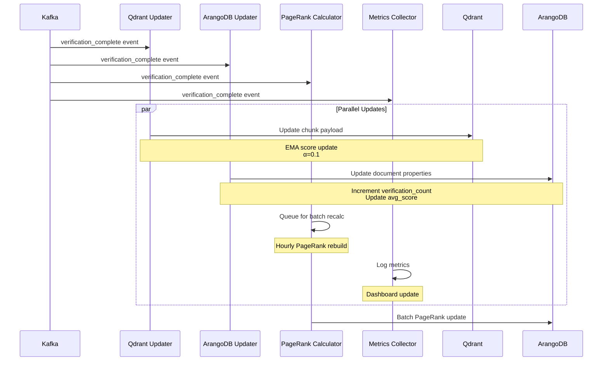
```mermaid
sequenceDiagram
    participant K as Kafka
    participant QU as Qdrant Updater
    participant AU as ArangoDB Updater
    participant PR as PageRank Calculator
    participant MC as Metrics Collector
    participant Q as Qdrant
    participant A as ArangoDB

    K->>QU: verification_complete event
    K->>AU: verification_complete event
    K->>PR: verification_complete event
    K->>MC: verification_complete event

    par Parallel Updates
        QU->>Q: Update chunk payload
        Note over QU,Q: EMA score update<br/>α=0.1

        AU->>A: Update document properties
        Note over AU,A: Increment verification_count<br/>Update avg_score

        PR->>PR: Queue for batch recalc
        Note over PR: Hourly PageRank rebuild

        MC->>MC: Log metrics
        Note over MC: Dashboard update
    end

    PR->>A: Batch PageRank update
```

### 4.3 Kafka Event Flow

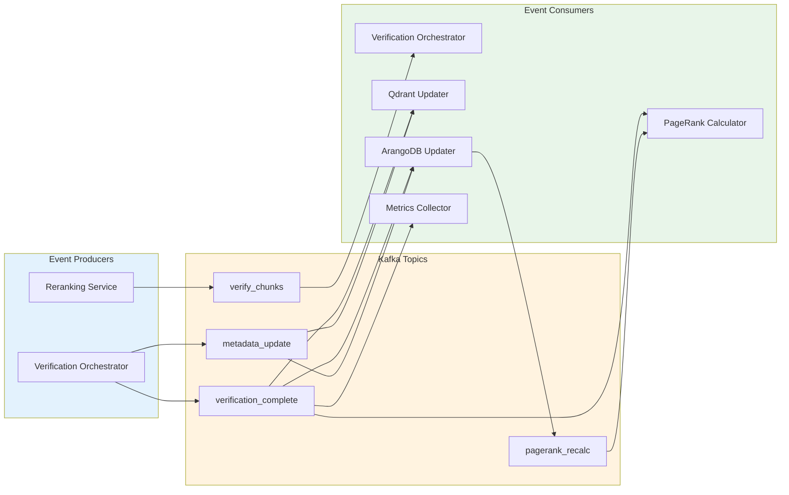
```mermaid
flowchart LR
    subgraph Producers["Event Producers"]
        RR[Reranking Service]
        VO[Verification Orchestrator]
    end

    subgraph Topics["Kafka Topics"]
        T1[verify_chunks]
        T2[verification_complete]
        T3[metadata_update]
        T4[pagerank_recalc]
    end

    subgraph Consumers["Event Consumers"]
        VO2[Verification Orchestrator]
        QU[Qdrant Updater]
        AU[ArangoDB Updater]
        PR[PageRank Calculator]
        MC[Metrics Collector]
    end

    RR --> T1
    VO --> T2
    VO --> T3
    AU --> T4

    T1 --> VO2
    T2 --> QU
    T2 --> AU
    T2 --> PR
    T2 --> MC
    T3 --> QU
    T3 --> AU
    T4 --> PR

    style Producers fill:#e3f2fd
    style Topics fill:#fff3e0
    style Consumers fill:#e8f5e9
```

---

## 5. Metadata Architecture

### 5.1 Qdrant Chunk Metadata Schema

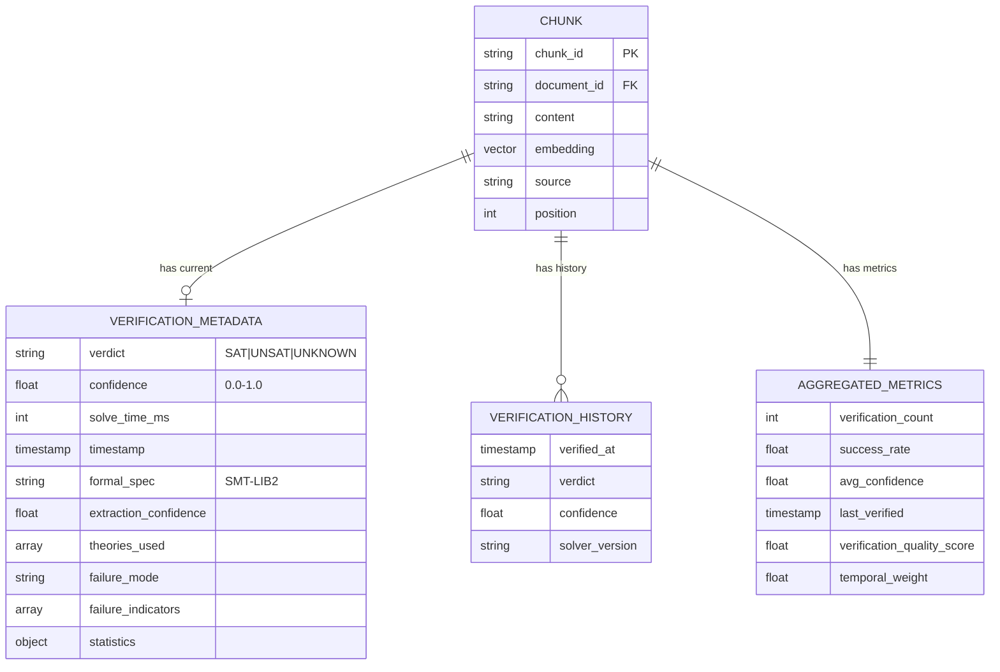
```mermaid
erDiagram
    CHUNK {
        string chunk_id PK
        string document_id FK
        string content
        vector embedding
        string source
        int position
    }

    VERIFICATION_METADATA {
        string verdict "SAT|UNSAT|UNKNOWN"
        float confidence "0.0-1.0"
        int solve_time_ms
        timestamp timestamp
        string formal_spec "SMT-LIB2"
        float extraction_confidence
        array theories_used
        string failure_mode
        array failure_indicators
        object statistics
    }

    VERIFICATION_HISTORY {
        timestamp verified_at
        string verdict
        float confidence
        string solver_version
    }

    AGGREGATED_METRICS {
        int verification_count
        float success_rate
        float avg_confidence
        timestamp last_verified
        float verification_quality_score
        float temporal_weight
    }

    CHUNK ||--o| VERIFICATION_METADATA : "has current"
    CHUNK ||--o{ VERIFICATION_HISTORY : "has history"
    CHUNK ||--|| AGGREGATED_METRICS : "has metrics"
```

### 5.2 ArangoDB Document Metadata Schema

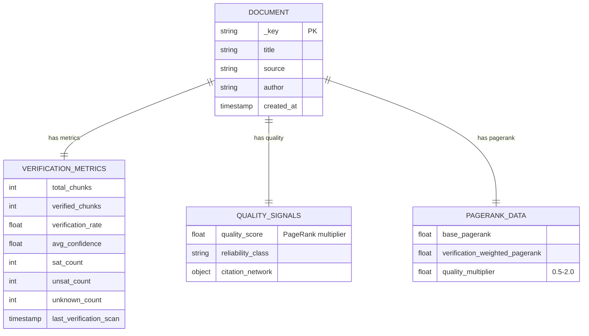
```mermaid
erDiagram
    DOCUMENT {
        string _key PK
        string title
        string source
        string author
        timestamp created_at
    }

    VERIFICATION_METRICS {
        int total_chunks
        int verified_chunks
        float verification_rate
        float avg_confidence
        int sat_count
        int unsat_count
        int unknown_count
        timestamp last_verification_scan
    }

    QUALITY_SIGNALS {
        float quality_score "PageRank multiplier"
        string reliability_class
        object citation_network
    }

    PAGERANK_DATA {
        float base_pagerank
        float verification_weighted_pagerank
        float quality_multiplier "0.5-2.0"
    }

    DOCUMENT ||--|| VERIFICATION_METRICS : "has metrics"
    DOCUMENT ||--|| QUALITY_SIGNALS : "has quality"
    DOCUMENT ||--|| PAGERANK_DATA : "has pagerank"
```

### 5.3 Complete Data Model Relationships

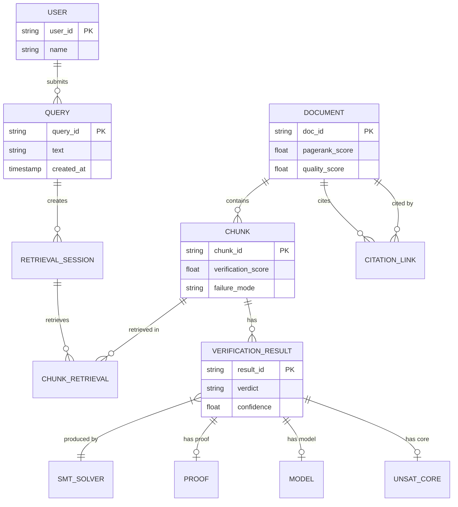
```mermaid
erDiagram
    USER ||--o{ QUERY : "submits"
    QUERY ||--o{ RETRIEVAL_SESSION : "creates"
    RETRIEVAL_SESSION ||--o{ CHUNK_RETRIEVAL : "retrieves"

    DOCUMENT ||--o{ CHUNK : "contains"
    CHUNK ||--o{ CHUNK_RETRIEVAL : "retrieved in"
    CHUNK ||--o{ VERIFICATION_RESULT : "has"

    VERIFICATION_RESULT }|--|| SMT_SOLVER : "produced by"
    VERIFICATION_RESULT ||--o| PROOF : "has proof"
    VERIFICATION_RESULT ||--o| MODEL : "has model"
    VERIFICATION_RESULT ||--o| UNSAT_CORE : "has core"

    DOCUMENT ||--o{ CITATION_LINK : "cites"
    CITATION_LINK }o--|| DOCUMENT : "cited by"

    USER {
        string user_id PK
        string name
    }

    QUERY {
        string query_id PK
        string text
        timestamp created_at
    }

    DOCUMENT {
        string doc_id PK
        float pagerank_score
        float quality_score
    }

    CHUNK {
        string chunk_id PK
        float verification_score
        string failure_mode
    }

    VERIFICATION_RESULT {
        string result_id PK
        string verdict
        float confidence
    }
```

---

## 6. Ranking Algorithm Architecture

### 6.1 Score Computation Flow

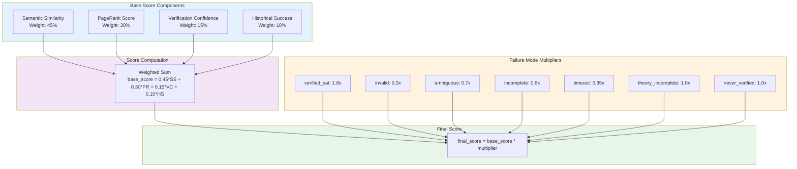
```mermaid
flowchart TD
    subgraph BaseScores["Base Score Components"]
        SS[Semantic Similarity<br/>Weight: 45%]
        PR[PageRank Score<br/>Weight: 30%]
        VC[Verification Confidence<br/>Weight: 15%]
        HS[Historical Success<br/>Weight: 10%]
    end

    subgraph Computation["Score Computation"]
        WS[Weighted Sum<br/>base_score = 0.45*SS + 0.30*PR + 0.15*VC + 0.10*HS]
    end

    subgraph Multipliers["Failure Mode Multipliers"]
        VS[verified_sat: 1.8x]
        INV[invalid: 0.3x]
        AMB[ambiguous: 0.7x]
        INC[incomplete: 0.8x]
        TO[timeout: 0.85x]
        TI[theory_incomplete: 1.0x]
        NV[never_verified: 1.0x]
    end

    subgraph Final["Final Score"]
        FS[final_score = base_score * multiplier]
    end

    SS --> WS
    PR --> WS
    VC --> WS
    HS --> WS

    WS --> FS
    VS --> FS
    INV --> FS
    AMB --> FS
    INC --> FS
    TO --> FS
    TI --> FS
    NV --> FS

    style BaseScores fill:#e3f2fd
    style Computation fill:#f3e5f5
    style Multipliers fill:#fff3e0
    style Final fill:#e8f5e9
```

### 6.2 Failure Mode Multiplier Impact

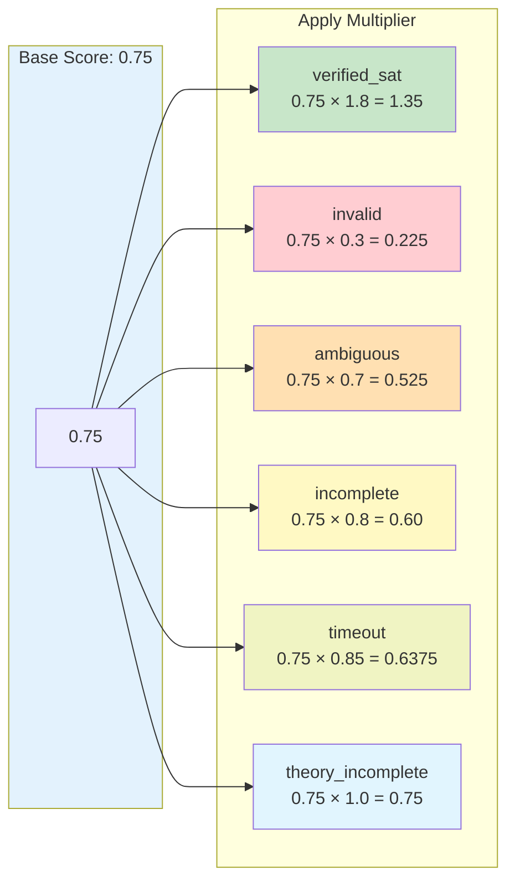
```mermaid
flowchart LR
    subgraph Input["Base Score: 0.75"]
        BS[0.75]
    end

    subgraph Multipliers["Apply Multiplier"]
        M1[verified_sat<br/>0.75 × 1.8 = 1.35]
        M2[invalid<br/>0.75 × 0.3 = 0.225]
        M3[ambiguous<br/>0.75 × 0.7 = 0.525]
        M4[incomplete<br/>0.75 × 0.8 = 0.60]
        M5[timeout<br/>0.75 × 0.85 = 0.6375]
        M6[theory_incomplete<br/>0.75 × 1.0 = 0.75]
    end

    BS --> M1
    BS --> M2
    BS --> M3
    BS --> M4
    BS --> M5
    BS --> M6

    style Input fill:#e3f2fd
    style M1 fill:#c8e6c9
    style M2 fill:#ffcdd2
    style M3 fill:#ffe0b2
    style M4 fill:#fff9c4
    style M5 fill:#f0f4c3
    style M6 fill:#e1f5fe
```

### 6.3 PageRank with Verification Quality

Standard PageRank formula modified to incorporate verification quality:

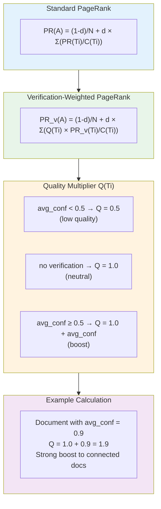
```mermaid
flowchart TD
    subgraph Standard["Standard PageRank"]
        SPR["PR(A) = (1-d)/N + d × Σ(PR(Ti)/C(Ti))"]
    end

    subgraph Modified["Verification-Weighted PageRank"]
        VPR["PR_v(A) = (1-d)/N + d × Σ(Q(Ti) × PR_v(Ti)/C(Ti))"]
    end

    subgraph QualityMultiplier["Quality Multiplier Q(Ti)"]
        Q1["avg_conf < 0.5 → Q = 0.5<br/>(low quality)"]
        Q2["no verification → Q = 1.0<br/>(neutral)"]
        Q3["avg_conf ≥ 0.5 → Q = 1.0 + avg_conf<br/>(boost)"]
    end

    subgraph Example["Example Calculation"]
        EX["Document with avg_conf = 0.9<br/>Q = 1.0 + 0.9 = 1.9<br/>Strong boost to connected docs"]
    end

    Standard --> Modified
    Modified --> QualityMultiplier
    QualityMultiplier --> Example

    style Standard fill:#e3f2fd
    style Modified fill:#e8f5e9
    style QualityMultiplier fill:#fff3e0
    style Example fill:#f3e5f5
```

---

## 7. Feedback Loop Architecture

### 7.1 Three-Tier Feedback System

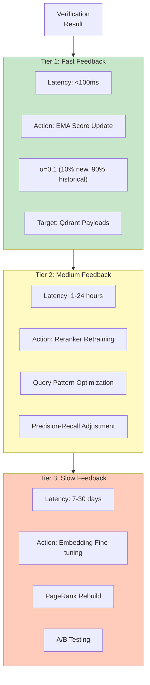
```mermaid
flowchart TB
    subgraph Tier1["Tier 1: Fast Feedback"]
        direction LR
        T1L["Latency: <100ms"]
        T1A["Action: EMA Score Update"]
        T1D["α=0.1 (10% new, 90% historical)"]
        T1T["Target: Qdrant Payloads"]
    end

    subgraph Tier2["Tier 2: Medium Feedback"]
        direction LR
        T2L["Latency: 1-24 hours"]
        T2A["Action: Reranker Retraining"]
        T2D["Query Pattern Optimization"]
        T2T["Precision-Recall Adjustment"]
    end

    subgraph Tier3["Tier 3: Slow Feedback"]
        direction LR
        T3L["Latency: 7-30 days"]
        T3A["Action: Embedding Fine-tuning"]
        T3D["PageRank Rebuild"]
        T3T["A/B Testing"]
    end

    VR[Verification<br/>Result] --> Tier1
    Tier1 --> Tier2
    Tier2 --> Tier3

    style Tier1 fill:#c8e6c9
    style Tier2 fill:#fff9c4
    style Tier3 fill:#ffccbc
```

### 7.2 Feedback Loop Safeguards

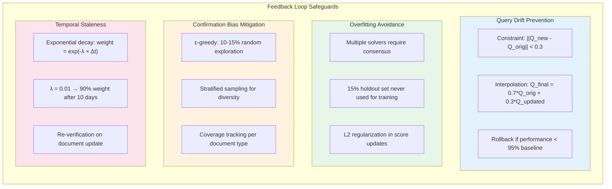
```mermaid
flowchart TD
    subgraph Safeguards["Feedback Loop Safeguards"]
        direction TB

        subgraph QueryDrift["Query Drift Prevention"]
            QD1["Constraint: ||Q_new - Q_orig|| < 0.3"]
            QD2["Interpolation: Q_final = 0.7*Q_orig + 0.3*Q_updated"]
            QD3["Rollback if performance < 95% baseline"]
        end

        subgraph Overfitting["Overfitting Avoidance"]
            OF1["Multiple solvers require consensus"]
            OF2["15% holdout set never used for training"]
            OF3["L2 regularization in score updates"]
        end

        subgraph ConfirmBias["Confirmation Bias Mitigation"]
            CB1["ε-greedy: 10-15% random exploration"]
            CB2["Stratified sampling for diversity"]
            CB3["Coverage tracking per document type"]
        end

        subgraph Temporal["Temporal Staleness"]
            TS1["Exponential decay: weight = exp(-λ × Δt)"]
            TS2["λ = 0.01 → 90% weight after 10 days"]
            TS3["Re-verification on document update"]
        end
    end

    style QueryDrift fill:#e3f2fd
    style Overfitting fill:#e8f5e9
    style ConfirmBias fill:#fff3e0
    style Temporal fill:#fce4ec
```

### 7.3 Exponential Moving Average Update

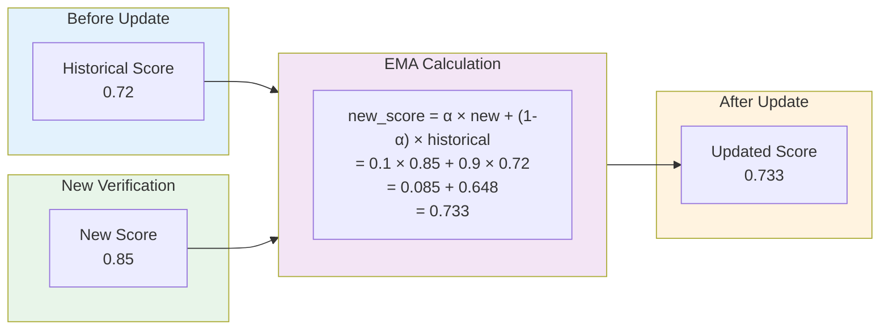
```mermaid
flowchart LR
    subgraph Before["Before Update"]
        H[Historical Score<br/>0.72]
    end

    subgraph New["New Verification"]
        N[New Score<br/>0.85]
    end

    subgraph EMA["EMA Calculation"]
        C["new_score = α × new + (1-α) × historical<br/>= 0.1 × 0.85 + 0.9 × 0.72<br/>= 0.085 + 0.648<br/>= 0.733"]
    end

    subgraph After["After Update"]
        U[Updated Score<br/>0.733]
    end

    H --> EMA
    N --> EMA
    EMA --> U

    style Before fill:#e3f2fd
    style New fill:#e8f5e9
    style EMA fill:#f3e5f5
    style After fill:#fff3e0
```

---

## 8. Failure Mode Decision System

### 8.1 Failure Mode Classification Tree

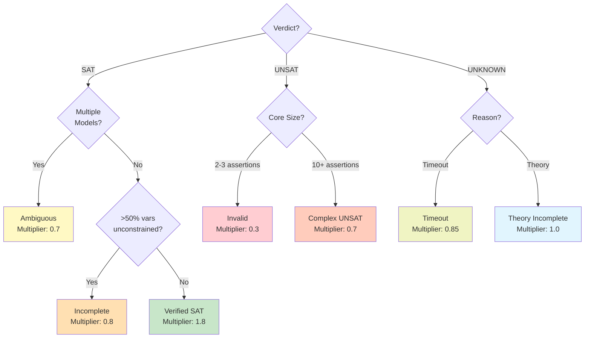
```mermaid
flowchart TD
    V{Verdict?}

    V -->|SAT| SAT_CHECK{Multiple<br/>Models?}
    V -->|UNSAT| UNSAT_CHECK{Core Size?}
    V -->|UNKNOWN| UNK_CHECK{Reason?}

    SAT_CHECK -->|Yes| AMB[Ambiguous<br/>Multiplier: 0.7]
    SAT_CHECK -->|No| VAR_CHECK{>50% vars<br/>unconstrained?}

    VAR_CHECK -->|Yes| INC[Incomplete<br/>Multiplier: 0.8]
    VAR_CHECK -->|No| VERIFIED[Verified SAT<br/>Multiplier: 1.8]

    UNSAT_CHECK -->|2-3 assertions| INV[Invalid<br/>Multiplier: 0.3]
    UNSAT_CHECK -->|10+ assertions| COMPLEX[Complex UNSAT<br/>Multiplier: 0.7]

    UNK_CHECK -->|Timeout| TIMEOUT[Timeout<br/>Multiplier: 0.85]
    UNK_CHECK -->|Theory| THEORY[Theory Incomplete<br/>Multiplier: 1.0]

    style VERIFIED fill:#c8e6c9
    style AMB fill:#fff9c4
    style INC fill:#ffe0b2
    style INV fill:#ffcdd2
    style COMPLEX fill:#ffccbc
    style TIMEOUT fill:#f0f4c3
    style THEORY fill:#e1f5fe
```

### 8.2 Detailed Failure Mode Characteristics

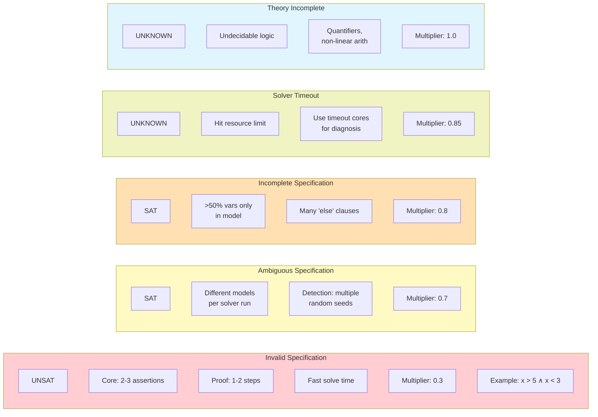
```mermaid
flowchart LR
    subgraph Invalid["Invalid Specification"]
        INV_V[UNSAT]
        INV_C[Core: 2-3 assertions]
        INV_P[Proof: 1-2 steps]
        INV_T[Fast solve time]
        INV_M[Multiplier: 0.3]
        INV_EX["Example: x > 5 ∧ x < 3"]
    end

    subgraph Ambiguous["Ambiguous Specification"]
        AMB_V[SAT]
        AMB_C["Different models<br/>per solver run"]
        AMB_D["Detection: multiple<br/>random seeds"]
        AMB_M["Multiplier: 0.7"]
    end

    subgraph Incomplete["Incomplete Specification"]
        INC_V[SAT]
        INC_C[">50% vars only<br/>in model"]
        INC_D["Many 'else' clauses"]
        INC_M["Multiplier: 0.8"]
    end

    subgraph Timeout["Solver Timeout"]
        TO_V[UNKNOWN]
        TO_C[Hit resource limit]
        TO_D["Use timeout cores<br/>for diagnosis"]
        TO_M["Multiplier: 0.85"]
    end

    subgraph TheoryInc["Theory Incomplete"]
        TI_V[UNKNOWN]
        TI_C[Undecidable logic]
        TI_D["Quantifiers,<br/>non-linear arith"]
        TI_M["Multiplier: 1.0"]
    end

    style Invalid fill:#ffcdd2
    style Ambiguous fill:#fff9c4
    style Incomplete fill:#ffe0b2
    style Timeout fill:#f0f4c3
    style TheoryInc fill:#e1f5fe
```

### 8.3 Verdict Handling State Machine

```mermaid
stateDiagram-v2
    [*] --> Verification: Submit chunk

    Verification --> SAT: Satisfiable
    Verification --> UNSAT: Unsatisfiable
    Verification --> UNKNOWN: Inconclusive

    SAT --> ModelAnalysis: Analyze model
    ModelAnalysis --> HighBoost: Single consistent model
    ModelAnalysis --> ModeratePenalty: Multiple interpretations
    ModelAnalysis --> SmallPenalty: Under-constrained

    UNSAT --> CoreAnalysis: Analyze unsat core
    CoreAnalysis --> HeavyPenalty: Small core (direct contradiction)
    CoreAnalysis --> ModeratePenalty: Large core (complex interaction)

    UNKNOWN --> ReasonAnalysis: Check reason
    ReasonAnalysis --> SmallPenalty: Timeout
    ReasonAnalysis --> Neutral: Theory incomplete

    HighBoost --> UpdateScore: 1.8x multiplier
    ModeratePenalty --> UpdateScore: 0.7x multiplier
    SmallPenalty --> UpdateScore: 0.8-0.85x multiplier
    HeavyPenalty --> UpdateScore: 0.3x multiplier
    Neutral --> UpdateScore: 1.0x multiplier

    UpdateScore --> [*]: Complete
```

---

## 9. Cold Start and Implementation Phases

### 9.1 Implementation Timeline

```mermaid
gantt
    title Hupyy-PipesHub Integration Implementation Timeline
    dateFormat  YYYY-MM-DD

    section Phase 1: Foundation
    Verification integration    :p1a, 2024-01-01, 14d
    Baseline metrics collection :p1b, after p1a, 7d
    Fast feedback loop         :p1c, after p1b, 7d

    section Phase 2: Fast Feedback
    Real-time score updates    :p2a, after p1c, 28d
    Data accumulation          :p2b, after p1c, 56d
    Initial improvements       :p2c, after p2a, 28d

    section Phase 3: Medium Feedback
    Reranker retraining        :p3a, after p2c, 42d
    Query pattern optimization :p3b, after p3a, 42d

    section Phase 4: Slow Feedback
    Embedding fine-tuning      :p4a, after p3b, 90d
    PageRank optimization      :p4b, after p3b, 90d
    Full optimization          :p4c, after p4a, 90d
```

### 9.2 Cold Start Handling Phases

```mermaid
flowchart TD
    subgraph Week1_2["Weeks 1-2: Initial Neutral"]
        W1[No verification penalty/boost]
        W2[Rely on semantic + basic PageRank]
        W3[Log all retrievals for candidates]
    end

    subgraph Week3["Week 3: Rapid Verification"]
        W3A[Prioritize frequently retrieved docs]
        W3B[Uncertainty sampling]
        W3C[20% budget to exploration]
    end

    subgraph Week4Plus["Week 4+: Transfer Learning"]
        W4A[Propagate scores from similar docs]
        W4B["initial = 0.7 × similar_avg + 0.3 × global_avg"]
        W4C[Gradual verification weight increase]
    end

    Week1_2 --> Week3
    Week3 --> Week4Plus

    style Week1_2 fill:#e3f2fd
    style Week3 fill:#fff9c4
    style Week4Plus fill:#c8e6c9
```

### 9.3 Expected Improvement Trajectory

```mermaid
flowchart LR
    subgraph Phase1["Phase 1<br/>Weeks 1-4"]
        P1M["NDCG: 0-2%"]
        P1P["Precision@5: +0%"]
        P1N["Note: Instrumentation<br/>overhead"]
    end

    subgraph Phase2["Phase 2<br/>Weeks 5-12"]
        P2M["NDCG: +3-5%"]
        P2P["Precision@5: +10-15%"]
        P2N["Fast feedback<br/>maturing"]
    end

    subgraph Phase3["Phase 3<br/>Weeks 13-24"]
        P3M["NDCG: +6-9%"]
        P3P["Precision@5: +25-35%"]
        P3N["Reranker<br/>optimized"]
    end

    subgraph Phase4["Phase 4<br/>Weeks 25-52"]
        P4M["NDCG: +8-12%"]
        P4P["Precision@5: Target 98%"]
        P4N["Full optimization"]
    end

    Phase1 --> Phase2 --> Phase3 --> Phase4

    style Phase1 fill:#ffcdd2
    style Phase2 fill:#fff9c4
    style Phase3 fill:#c8e6c9
    style Phase4 fill:#bbdefb
```

### 9.4 Weight Transition During Cold Start

```mermaid
flowchart TD
    subgraph Days1_7["Days 1-7: Pseudo-Relevance"]
        D1["Semantic: 90%"]
        D2["Pseudo-feedback: 10%"]
        D3["Verification: 0%"]
    end

    subgraph Days8_30["Days 8-30: Hybrid"]
        D4["Semantic: 70% → 55%"]
        D5["PageRank: 20% → 30%"]
        D6["Verification: 10% → 15%"]
    end

    subgraph Days30Plus["Day 30+: Full Integration"]
        D7["Semantic: 45%"]
        D8["PageRank: 30%"]
        D9["Verification: 15%"]
        D10["Historical: 10%"]
    end

    Days1_7 --> Days8_30 --> Days30Plus

    style Days1_7 fill:#e3f2fd
    style Days8_30 fill:#fff9c4
    style Days30Plus fill:#c8e6c9
```

---

## 10. Monitoring and Health Dashboard

### 10.1 Dashboard Metrics Overview

```mermaid
flowchart TB
    subgraph RetrievalQuality["Retrieval Quality Metrics"]
        RQ1["NDCG@10<br/>Baseline: 0.65-0.70<br/>Target: 0.75-0.80"]
        RQ2["MRR<br/>Baseline: 0.55<br/>Target: 0.70"]
        RQ3["Precision@5<br/>Baseline: 40%<br/>Target: 98%"]
        RQ4["Recall@50<br/>Target: 90%+"]
    end

    subgraph VerificationMetrics["Verification Metrics"]
        VM1["Total Verifications"]
        VM2["Success Rate"]
        VM3["Avg Confidence"]
        VM4["Avg Solve Time"]
    end

    subgraph FeedbackHealth["Feedback Loop Health"]
        FH1["Coverage<br/>(doc types ≥5 verifications)"]
        FH2["Diversity Entropy<br/>Target: ≥3.0 bits"]
        FH3["Query Drift<br/>Limit: <0.3"]
        FH4["Exploration Rate<br/>Target: 10-15%"]
    end

    subgraph SystemPerf["System Performance"]
        SP1["Avg Query Latency"]
        SP2["Verification Queue"]
        SP3["Cache Hit Rate"]
        SP4["Kafka Lag"]
    end

    style RetrievalQuality fill:#e3f2fd
    style VerificationMetrics fill:#e8f5e9
    style FeedbackHealth fill:#fff3e0
    style SystemPerf fill:#fce4ec
```

### 10.2 Failure Mode Distribution Dashboard

```mermaid
flowchart LR
    subgraph Distribution["Verification Outcome Distribution"]
        direction TB
        VSAT["verified_sat<br/>Target: 40-50%"]
        INV["invalid<br/>Target: <10%"]
        AMB["ambiguous<br/>Target: <15%"]
        INC["incomplete<br/>Target: <15%"]
        TO["timeout<br/>Target: <10%"]
        TI["theory_incomplete<br/>Target: <10%"]
    end

    subgraph Health["Health Indicators"]
        direction TB
        H1["Green: Distribution<br/>within targets"]
        H2["Yellow: One category<br/>5% over target"]
        H3["Red: Multiple categories<br/>over target"]
    end

    Distribution --> Health

    style VSAT fill:#c8e6c9
    style INV fill:#ffcdd2
    style AMB fill:#fff9c4
    style INC fill:#ffe0b2
    style TO fill:#f0f4c3
    style TI fill:#e1f5fe
```

### 10.3 Alert System

```mermaid
flowchart TD
    subgraph Critical["CRITICAL Alerts"]
        C1["Holdout perf >10% below training<br/>Action: Rollback recent updates"]
        C2["Success rate drops >20%<br/>Action: Investigate solver issues"]
    end

    subgraph Warning["WARNING Alerts"]
        W1["Diversity <3.0 bits<br/>Action: Increase exploration"]
        W2["Verification queue >100<br/>Action: Scale verification service"]
        W3["Query drift >0.3<br/>Action: Reduce feedback weight"]
    end

    subgraph Info["INFO Alerts"]
        I1["Success rate change >5% WoW<br/>Action: Analyze change cause"]
        I2["New document type detected<br/>Action: Allocate verification budget"]
    end

    Critical --> Pager[PagerDuty]
    Warning --> Slack[Slack Channel]
    Info --> Dashboard[Dashboard Log]

    style Critical fill:#ffcdd2
    style Warning fill:#fff9c4
    style Info fill:#e3f2fd
```

### 10.4 Performance Monitoring Flow

```mermaid
sequenceDiagram
    participant MC as Metrics Collector
    participant TS as Time Series DB
    participant DS as Dashboard
    participant AL as Alert Manager

    loop Every Verification
        MC->>TS: Record metrics
        Note over MC,TS: verdict, confidence,<br/>solve_time, failure_mode
    end

    loop Every Minute
        TS->>DS: Aggregate metrics
        DS->>DS: Update visualizations
    end

    loop Every 5 Minutes
        TS->>AL: Check thresholds
        alt Threshold exceeded
            AL->>AL: Generate alert
            AL-->>DS: Display alert
        end
    end
```

---

## Summary

This architecture documentation provides a comprehensive view of the Hupyy-PipesHub integration, covering:

1. **System Architecture**: Microservice-based design with Kafka event-driven messaging
2. **Data Flow**: Multi-stage pipeline from query to verified results
3. **Three-Stage Pipeline**: Semantic retrieval → Formal verification → Feedback integration
4. **Component Interactions**: Sequence diagrams showing verification and feedback flows
5. **Metadata Schema**: ER diagrams for Qdrant and ArangoDB storage
6. **Ranking Algorithm**: Weighted scoring with failure mode multipliers
7. **Feedback Loops**: Three-tier system (fast/medium/slow) with safeguards
8. **Failure Mode Classification**: Decision tree for verdict handling
9. **Implementation Timeline**: Gantt chart with expected improvements
10. **Monitoring**: Dashboard metrics and alert system

**Key Design Decisions:**
- Verification weight starts at 15% and increases based on data accumulation
- Failure mode multipliers range from 0.3x (invalid) to 1.8x (verified_sat)
- EMA smoothing with α=0.1 for real-time score updates
- PageRank modified with quality multipliers (0.5-2.0)
- Cold start uses three-phase approach over 30 days
